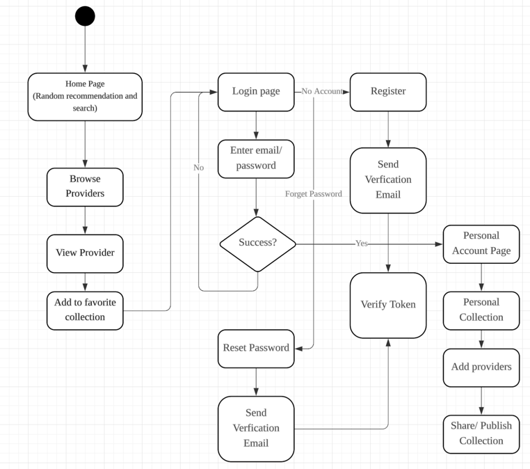

# Project-6-Ruby-No-Fails

# Demo Video
https://github.com/user-attachments/assets/2a4e0553-0f73-4b11-8019-5eb1ba952095

# How to run the project
```bash
bundle install
rails server -b 0.0.0.0
cd frontend/Yami
npm install # or bun install
npx expo start --clear
```
Account: a@p-p.men, Password: a@p-p.men

Scan the QR code above with Expo Go (Android) or the Expo Go (iOS), or press i open ios simulator or w open a website

## How to run test case
```bash
bundle exec rspec spec/requests/api/v1/collections_spec.rb spec/requests/api/v1/user/collections_spec.rb spec/requests/api/v1/user/collection_items_spec.rb --format progress
```

# Description

Our Project 6 is a web platform designed to connect users with local service providers. The application addresses the challenge of finding reliable services by aggregating and curating information from various sources, including Google and Yelp. Key features include a powerful search and filtering engine (by category, date, and location), user-created personal collections of favorite providers, and a public space for sharing and discovering community-curated lists. The platform aims to simplify the process of finding and organizing local services while fostering a community of users who share valuable recommendations.

# Managers
Project Manager: Paulina Salazar
Meeting Manager: Linus Xiong
# Use Cases

### Use Case 1: User Registration
* **Use Case Number**: 1
* **Application**: Service Provider Platform
* **Description**: The system allows new users to create an account by providing their name, email, and password, followed by email verification with Cloudflare Turnstile protection.

#### Actors
* **Primary**: Unregistered User
* **Other**: Email Service Provider, Cloudflare Turnstile Service

#### Stakeholders
* **User**: Wants to create an account to access platform features.
* **Platform Owner**: Wants to verify user authenticity and prevent spam/bot registrations.

#### Preconditions
* User has access to the platform registration page.
* User has a valid email address.
* Cloudflare Turnstile service is operational.
* Email service is functional.

#### Trigger
* User accesses the registration page and decides to create an account.

#### Basic Flow
1.  User navigates to the registration page.
2.  User enters their name, email address, and password.
3.  System validates input format and password strength.
4.  System presents Cloudflare Turnstile challenge.
5.  User completes the Turnstile verification.
6.  System creates user account with unverified status.
7.  System sends verification email to provided email address.
8.  User receives email and clicks verification link.
9.  System activates the user account.
10. System redirects user to login page with success message.

#### Alternative Paths
* **A1: Email already exists** - System displays error message and prompts user to login or reset password.
* **A2: Turnstile verification fails** - System prompts user to retry verification.
* **A3: Email delivery fails** - System provides option to resend verification email.
* **A4: Verification link expires** - System allows user to request new verification email.

---

### Use Case 2: User Login
* **Use Case Number**: 2
* **Application**: Service Provider Platform
* **Description**: The system allows registered users to authenticate and access their account with Cloudflare Turnstile protection.

#### Actors
* **Primary**: Registered User
* **Other**: Cloudflare Turnstile Service

#### Stakeholders
* **User**: Wants to access their account and platform features.
* **Platform Owner**: Wants to ensure secure access and prevent unauthorized login attempts.

#### Preconditions
* User has a registered and activated account.
* Cloudflare Turnstile service is operational.
* User remembers their login credentials.

#### Trigger
* User attempts to access protected features or navigates to login page.

#### Basic Flow
1.  User navigates to login page.
2.  User enters email and password.
3.  System presents Cloudflare Turnstile challenge.
4.  User completes the Turnstile verification.
5.  System validates credentials against database.
6.  System creates user session.
7.  System redirects user to home page or intended destination.

#### Alternative Paths
* **A1: Invalid credentials** - System displays error message and allows retry.
* **A2: Unverified account** - System prompts user to verify email first.
* **A3: Turnstile verification fails** - System prompts user to retry verification.
* **A4: Account locked** - System displays lockout message and recovery options.

---

### Use Case 3: Password Recovery
* **Use Case Number**: 3
* **Application**: Service Provider Platform
* **Description**: The system allows users to reset their forgotten password through email verification with Cloudflare Turnstile protection.

#### Actors
* **Primary**: Registered User
* **Other**: Email Service Provider, Cloudflare Turnstile Service

#### Stakeholders
* **User**: Wants to regain access to their account when password is forgotten.
* **Platform Owner**: Wants to provide secure password recovery while preventing abuse.

#### Preconditions
* User has a registered account.
* User has access to their registered email.
* Cloudflare Turnstile service is operational.
* Email service is functional.

#### Trigger
* User clicks "Forgot Password" link on login page.

#### Basic Flow
1.  User clicks "Forgot Password" link.
2.  System displays password recovery form.
3.  User enters their registered email address.
4.  System presents Cloudflare Turnstile challenge.
5.  User completes the Turnstile verification.
6.  System validates email exists in database.
7.  System generates password reset token.
8.  System sends password reset email with secure link.
9.  User clicks reset link in email.
10. System validates token and displays new password form.
11. User enters new password and confirms.
12. System updates password in database.
13. System displays success message and redirects to login.

#### Alternative Paths
* **A1: Email not found** - System displays generic message (security measure).
* **A2: Turnstile verification fails** - System prompts user to retry verification.
* **A3: Reset link expired** - System prompts user to request new reset link.
* **A4: Invalid token** - System displays error and redirects to password recovery.

---

### Use Case 4: Browse Service Providers
* **Use Case Number**: 4
* **Application**: Service Provider Platform
* **Description**: The system allows users to search and filter service providers by category, name, and operating date.

#### Actors
* **Primary**: User (logged in or guest)
* **Other**: None

#### Stakeholders
* **User**: Wants to find suitable service providers for their needs.
* **Service Providers**: Want their services to be discoverable by potential customers.
* **Platform Owner**: Wants to provide effective search functionality.

#### Preconditions
* Platform has service provider data from Google API and Yelp API.
* User is on the home page.
* Service provider database is populated and accessible.

#### Trigger
* User navigates to home page or performs search action.

#### Basic Flow
1.  User accesses the home page.
2.  System displays service provider categories (haircut, garbage collection, house cleaning, car wash, etc.).
3.  User selects category filter or enters search term.
4.  User optionally selects date to filter by operating hours.
5.  System queries database for matching service providers.
6.  System displays filtered results with provider details.
7.  User browses through results.
8.  User can click on provider for detailed information.

#### Alternative Paths
* **A1: No results found** - System displays "no results" message with suggestions.
* **A2: Search timeout** - System displays error message and retry option.
* **A3: Invalid date selection** - System prompts user to select valid date.

---

### Use Case 5: Create Personal Collection
* **Use Case Number**: 5
* **Application**: Service Provider Platform
* **Description**: The system allows logged-in users to create personal collections of favorite service providers.

#### Actors
* **Primary**: Logged-in User
* **Other**: None

#### Stakeholders
* **User**: Wants to organize and save favorite service providers.
* **Platform Owner**: Wants to increase user engagement and retention.

#### Preconditions
* User is logged in.
* User has browsed service providers.
* Service provider data is available.

#### Trigger
* User clicks favorite/like button on service provider or navigates to collections page.

#### Basic Flow
1.  User finds a service provider they like.
2.  User clicks the favorite/like button.
3.  System adds provider to user's personal collection.
4.  System displays confirmation message.
5.  User can view their collection on the collections tab.
6.  User can organize, rename, or remove items from collection.

#### Alternative Paths
* **A1: User not logged in** - System redirects to login page.
* **A2: Provider already in collection** - System displays message and option to remove.
* **A3: Collection limit reached** - System prompts user to remove items or upgrade.

---

### Use Case 6: Share Collection Publicly
* **Use Case Number**: 6
* **Application**: Service Provider Platform
* **Description**: The system allows users to post their personal collections to the public sharing area.

#### Actors
* **Primary**: Logged-in User
* **Other**: Other Platform Users

#### Stakeholders
* **User**: Wants to share their curated list with community.
* **Other Users**: Want to discover collections from other users.
* **Platform Owner**: Wants to increase user engagement and content sharing.

#### Preconditions
* User is logged in.
* User has created at least one collection.
* Collection contains at least one service provider.

#### Trigger
* User clicks "Share Publicly" button in their collection.

#### Basic Flow
1.  User navigates to their collections.
2.  User selects collection to share.
3.  User clicks "Share Publicly" button.
4.  System displays sharing options and privacy settings.
5.  User adds title, description, and privacy settings.
6.  User confirms sharing.
7.  System posts collection to public sharing area.
8.  Other users can view and interact with shared collection.

#### Alternative Paths
* **A1: Empty collection** - System prompts user to add items before sharing.
* **A2: Duplicate title** - System suggests alternative title or allows modification.
* **A3: Content violation** - System flags collection for review before publishing.

---

### Use Case 7: View Public Collections
* **Use Case Number**: 7
* **Application**: Service Provider Platform
* **Description**: The system allows users to browse and view collections shared by other users in the public area.

#### Actors
* **Primary**: User (logged in or guest)
* **Other**: Collection Authors

#### Stakeholders
* **User**: Wants to discover new service providers through community recommendations.
* **Collection Authors**: Want their collections to be viewed and appreciated.
* **Platform Owner**: Wants to facilitate community engagement.

#### Preconditions
* Public collections exist in the system.
* User is on the collections tab.
* Public sharing area is accessible.

#### Trigger
* User navigates to collections tab and selects public collections.

#### Basic Flow
1.  User navigates to collections tab.
2.  User selects "Public Collections" section.
3.  System displays list of public collections.
4.  User browses through available collections.
5.  User clicks on collection to view details.
6.  System displays collection contents and author information.
7.  User can view service providers within collection.
8.  User can like or comment on collection (if logged in).

#### Alternative Paths
* **A1: No public collections** - System displays message encouraging users to share.
* **A2: Collection unavailable** - System displays error message if collection was removed.
* **A3: Login required for interaction** - System prompts login for liking/commenting.

---

### Use Case 8: Auto-redirect to Login
* **Use Case Number**: 8
* **Application**: Service Provider Platform
* **Description**: The system automatically redirects users to login page when they attempt to perform actions requiring authentication.

#### Actors
* **Primary**: Unauthenticated User
* **Other**: None

#### Stakeholders
* **User**: Wants seamless access to features after authentication.
* **Platform Owner**: Wants to protect user-specific features while maintaining good UX.

#### Preconditions
* User is not logged in.
* User attempts to perform authenticated action.
* Login system is operational.

#### Trigger
* User clicks favorite/like button, tries to create collection, or access protected features.

#### Basic Flow
1.  User performs action requiring authentication.
2.  System detects user is not logged in.
3.  System stores intended action/destination.
4.  System redirects user to login page.
5.  System displays message explaining login requirement.
6.  User completes login process.
7.  System redirects user back to original intended action/page.
8.  System completes the originally requested action.

#### Alternative Paths
* **A1: User cancels login** - System returns to previous page without completing action.
* **A2: Login fails** - System keeps user on login page with error message.
* **A3: Session expires during action** - System re-prompts for login and continues.

---

## Routes

### Providers Routes

#### `GET /api/v1/providers`
* **Description**: Retrieve all service providers with optional pagination.
* **Verb**: GET
* **Authentication**: Optional (some features require login)
* **Query Parameters**:
    * `page` (integer, optional): Page number for pagination (default: 1).
    * `limit` (integer, optional): Number of items per page (default: 20, max: 100).
    * `sort` (string, optional): Sort order - name_asc, name_desc, rating_asc, rating_desc, created_asc, created_desc (default: name_asc).
    * `include_closed` (boolean, optional): Include providers that are currently closed (default: false).
* **Response Format**:
    ```json
    {
      "success": true,
      "data": {
        "providers": [
          {
            "id": "string",
            "name": "string",
            "category": "string",
            "rating": "number",
            "address": "string",
            "phone": "string",
            "is_open": "boolean",
            "hours": "object",
            "image_url": "string"
          }
        ],
        "pagination": {
          "current_page": "number",
          "total_pages": "number",
          "total_items": "number",
          "has_next": "boolean",
          "has_previous": "boolean"
        }
      }
    }
    ```
* **Error Responses**:
    * `400 Bad Request`: Invalid query parameters.
    * `500 Internal Server Error`: Server error.

---

#### `GET /api/v1/providers/search`
* **Description**: Search and filter service providers by various criteria.
* **Verb**: GET
* **Authentication**: Optional
* **Query Parameters**:
    * `q` (string, optional): Search query for provider name or description.
    * `category` (string, optional): Filter by service category (e.g., "haircut", "cleaning", "car_wash").
    * `date` (string, optional): Filter by operating date (format: YYYY-MM-DD).
    * `latitude` (number, optional): User's latitude for location-based search.
    * `longitude` (number, optional): User's longitude for location-based search.
    * `radius` (number, optional): Search radius in kilometers (default: 10, max: 50).
    * `min_rating` (number, optional): Minimum rating filter (1-5).
    * `price_range` (string, optional): Price range filter - $, $$, $$$, $$$$.
    * `open_now` (boolean, optional): Filter for currently open providers (default: false).
    * `page` (integer, optional): Page number for pagination (default: 1).
    * `limit` (integer, optional): Number of items per page (default: 20, max: 100).
    * `sort` (string, optional): Sort order - relevance, distance, rating, name (default: relevance).
* **Response Format**:
    ```json
    {
      "success": true,
      "data": {
        "providers": [
          {
            "id": "string",
            "name": "string",
            "category": "string",
            "rating": "number",
            "address": "string",
            "distance": "number",
            "is_open": "boolean",
            "price_range": "string",
            "image_url": "string",
            "relevance_score": "number"
          }
        ],
        "search_metadata": {
          "query": "string",
          "filters_applied": "object",
          "total_results": "number"
        },
        "pagination": {
          "current_page": "number",
          "total_pages": "number",
          "has_next": "boolean",
          "has_previous": "boolean"
        }
      }
    }
    ```
* **Error Responses**:
    * `400 Bad Request`: Invalid search parameters.
    * `422 Unprocessable Entity`: Invalid date format or coordinates.
    * `500 Internal Server Error`: Server error.

---

#### `GET /api/v1/providers/:id`
* **Description**: Get detailed information about a specific service provider.
* **Verb**: GET
* **Authentication**: Optional
* **Path Parameters**:
    * `id` (string, required): Unique identifier of the service provider.
* **Query Parameters**:
    * `include_reviews` (boolean, optional): Include customer reviews (default: false).
    * `include_photos` (boolean, optional): Include photo gallery (default: false).
    * `include_services` (boolean, optional): Include detailed service list (default: false).
* **Response Format**:
    ```json
    {
      "success": true,
      "data": {
        "provider": {
          "id": "string",
          "name": "string",
          "description": "string",
          "category": "string",
          "subcategory": "string",
          "rating": "number",
          "review_count": "number",
          "address": "string",
          "phone": "string",
          "email": "string",
          "website": "string",
          "price_range": "string",
          "hours": {
            "monday": "string",
            "tuesday": "string",
            "wednesday": "string",
            "thursday": "string",
            "friday": "string",
            "saturday": "string",
            "sunday": "string"
          },
          "location": {
            "latitude": "number",
            "longitude": "number"
          },
          "images": ["string"],
          "services": [
            {
              "name": "string",
              "description": "string",
              "price": "string"
            }
          ],
          "reviews": [
            {
              "id": "string",
              "author": "string",
              "rating": "number",
              "comment": "string",
              "date": "string"
            }
          ],
          "is_favorited": "boolean",
          "created_at": "string",
          "updated_at": "string"
        }
      }
    }
    ```
* **Error Responses**:
    * `404 Not Found`: Provider not found.
    * `500 Internal Server Error`: Server error.

---

### User Collections Route

#### `GET /api/v1/collections`
* **Description**: Retrieve all public collections with pagination.
* **Verb**: GET
* **Authentication**: Optional
* **Query Parameters**:
    * `page` (integer, optional): Page number for pagination (default: 1).
    * `limit` (integer, optional): Number of items per page (default: 20, max: 100).
    * `sort` (string, optional): Sort order - popular, recent, name_asc, name_desc (default: popular).
    * `category` (string, optional): Filter collections by service category.
    * `search` (string, optional): Search collections by title or description.
* **Response Format**:
    ```json
    {
      "success": true,
      "data": {
        "collections": [
          {
            "id": "string",
            "title": "string",
            "description": "string",
            "author": {
              "id": "string",
              "name": "string",
              "avatar_url": "string"
            },
            "provider_count": "number",
            "like_count": "number",
            "view_count": "number",
            "is_liked": "boolean",
            "created_at": "string",
            "updated_at": "string",
            "thumbnail_url": "string"
          }
        ],
        "pagination": {
          "current_page": "number",
          "total_pages": "number",
          "total_items": "number",
          "has_next": "boolean",
          "has_previous": "boolean"
        }
      }
    }
    ```
* **Error Responses**:
    * `400 Bad Request`: Invalid query parameters.
    * `500 Internal Server Error`: Server error.

---

#### `GET /api/v1/collections/:id`
* **Description**: Get detailed information about a specific public collection.
* **Verb**: GET
* **Authentication**: Optional
* **Path Parameters**:
    * `id` (string, required): Unique identifier of the collection.
* **Response Format**:
    ```json
    {
      "success": true,
      "data": {
        "collection": {
          "id": "string",
          "title": "string",
          "description": "string",
          "author": {
            "id": "string",
            "name": "string",
            "avatar_url": "string"
          },
          "providers": [
            {
              "id": "string",
              "name": "string",
              "category": "string",
              "rating": "number",
              "address": "string",
              "image_url": "string",
              "added_at": "string",
              "note": "string"
            }
          ],
          "like_count": "number",
          "view_count": "number",
          "is_liked": "boolean",
          "created_at": "string",
          "updated_at": "string",
          "tags": ["string"]
        }
      }
    }
    ```
* **Error Responses**:
    * `404 Not Found`: Collection not found.
    * `403 Forbidden`: Collection is private.
    * `500 Internal Server Error`: Server error.

---

### User Route

#### `POST /api/v1/auth/register`
* **Description**: Register a new user account with email verification.
* **Verb**: POST
* **Authentication**: None (public endpoint)
* **Request Body**:
    ```json
    {
      "name": "string (required, 2-50 characters)",
      "email": "string (required, valid email format)",
      "password": "string (required, min 8 characters)",
      "password_confirmation": "string (required, must match password)",
      "turnstile_token": "string (required, Cloudflare Turnstile token)"
    }
    ```
* **Response Format**:
    ```json
    {
      "success": true,
      "message": "Registration successful. Please check your email for verification instructions.",
      "data": {
        "user": {
          "id": "string",
          "name": "string",
          "email": "string",
          "is_verified": false,
          "created_at": "string"
        }
      }
    }
    ```
* **Error Responses**:
    * `400 Bad Request`: Invalid input data or validation errors.
    * `409 Conflict`: Email already exists.
    * `422 Unprocessable Entity`: Turnstile verification failed.
    * `500 Internal Server Error`: Server error.

---

#### `POST /api/v1/auth/login`
* **Description**: Authenticate user and create session.
* **Verb**: POST
* **Authentication**: None (public endpoint)
* **Request Body**:
    ```json
    {
      "email": "string (required, valid email format)",
      "password": "string (required)",
      "turnstile_token": "string (required, Cloudflare Turnstile token)",
      "remember_me": "boolean (optional, default: false)"
    }
    ```
* **Response Format**:
    ```json
    {
      "success": true,
      "message": "Login successful",
      "data": {
        "user": {
          "id": "string",
          "name": "string",
          "email": "string",
          "is_verified": "boolean",
          "avatar_url": "string",
          "created_at": "string"
        },
        "access_token": "string",
        "refresh_token": "string",
        "expires_in": "number"
      }
    }
    ```
* **Error Responses**:
    * `400 Bad Request`: Invalid input data.
    * `401 Unauthorized`: Invalid credentials.
    * `403 Forbidden`: Account not verified.
    * `422 Unprocessable Entity`: Turnstile verification failed.
    * `429 Too Many Requests`: Rate limit exceeded.
    * `500 Internal Server Error`: Server error.

---

#### `POST /api/v1/auth/password/forgot`
* **Description**: Request password reset email.
* **Verb**: POST
* **Authentication**: None (public endpoint)
* **Request Body**:
    ```json
    {
      "email": "string (required, valid email format)",
      "turnstile_token": "string (required, Cloudflare Turnstile token)"
    }
    ```
* **Response Format**:
    ```json
    {
      "success": true,
      "message": "If an account with that email exists, you will receive password reset instructions."
    }
    ```
* **Error Responses**:
    * `400 Bad Request`: Invalid input data.
    * `422 Unprocessable Entity`: Turnstile verification failed.
    * `429 Too Many Requests`: Rate limit exceeded.
    * `500 Internal Server Error`: Server error.

---

#### `POST /api/v1/auth/password/reset`
* **Description**: Reset password using reset token.
* **Verb**: POST
* **Authentication**: None (public endpoint)
* **Request Body**:
    ```json
    {
      "token": "string (required, password reset token)",
      "email": "string (required, valid email format)",
      "password": "string (required, min 8 characters)",
      "password_confirmation": "string (required, must match password)"
    }
    ```
* **Response Format**:
    ```json
    {
      "success": true,
      "message": "Password reset successful. You can now login with your new password."
    }
    ```
* **Error Responses**:
    * `400 Bad Request`: Invalid input data or validation errors.
    * `401 Unauthorized`: Invalid or expired token.
    * `422 Unprocessable Entity`: Token and email mismatch.
    * `500 Internal Server Error`: Server error.

---

#### `GET /api/v1/auth/verify/:token`
* **Description**: Verify user email address using verification token.
* **Verb**: GET
* **Authentication**: None (public endpoint)
* **Path Parameters**:
    * `token` (string, required): Email verification token.
* **Response Format**:
    ```json
    {
      "success": true,
      "message": "Email verified successfully. You can now login to your account.",
      "data": {
        "user": {
          "id": "string",
          "name": "string",
          "email": "string",
          "is_verified": true,
          "verified_at": "string"
        }
      }
    }
    ```
* **Error Responses**:
    * `400 Bad Request`: Invalid token format.
    * `401 Unauthorized`: Invalid or expired token.
    * `409 Conflict`: Email already verified.
    * `500 Internal Server Error`: Server error.

---

### User-Specific Endpoints (Authenticated)

#### `GET /api/v1/user/collections`
* **Description**: Get user's personal collections.
* **Verb**: GET
* **Authentication**: Required (Bearer token)
* **Query Parameters**:
    * `page` (integer, optional): Page number for pagination (default: 1).
    * `limit` (integer, optional): Number of items per page (default: 20, max: 100).
    * `sort` (string, optional): Sort order - recent, name_asc, name_desc (default: recent).
* **Response Format**:
    ```json
    {
      "success": true,
      "data": {
        "collections": [
          {
            "id": "string",
            "title": "string",
            "description": "string",
            "provider_count": "number",
            "is_public": "boolean",
            "like_count": "number",
            "view_count": "number",
            "created_at": "string",
            "updated_at": "string"
          }
        ],
        "pagination": {
          "current_page": "number",
          "total_pages": "number",
          "total_items": "number"
        }
      }
    }
    ```

#### `POST /api/v1/user/collections`
* **Description**: Create a new personal collection.
* **Verb**: POST
* **Authentication**: Required (Bearer token)
* **Request Body**:
    ```json
    {
      "title": "string (required, 3-100 characters)",
      "description": "string (optional, max 500 characters)",
      "is_public": "boolean (optional, default: false)",
      "provider_ids": ["string"]
    }
    ```

#### `DELETE /api/v1/user/collections`
* **Description**: Delete a new personal collection.
* **Verb**: Delete
* **Authentication**: Required (Bearer token)
* **Path Parameters**:
    * `collections_id` (string, required): ID of the user collections.

#### `PUT /api/v1/user/collections/:id/publish`
* **Description**: Publish or unpublish a personal collection to make it publicly visible.
* **Verb**: PUT
* **Authentication**: Required (Bearer token)
* **Path Parameters**:
    * `id` (string, required): Unique identifier of the collection to publish/unpublish.

#### `POST /api/v1/user/favorites/:provider_id`
* **Description**: Add provider to user's favorites.
* **Verb**: POST
* **Authentication**: Required (Bearer token)
* **Path Parameters**:
    * `provider_id` (string, required): ID of the provider to favorite.
    * `collections_id` (string, required): ID of the user collections.

#### `DELETE /api/v1/user/favorites/:provider_id`
* **Description**: Remove provider from user's favorites.
* **Verb**: DELETE
* **Authentication**: Required (Bearer token)
* **Path Parameters**:
    * `provider_id` (string, required): ID of the provider to unfavorite.
    * `collections_id` (string, required): ID of the user collections.

---

## Rate Limiting
* **Authentication endpoints**: 5 requests per minute per IP
* **Search endpoints**: 100 requests per minute per IP
* **General endpoints**: 1000 requests per hour per user
* **File upload endpoints**: 10 requests per minute per user

## Common HTTP Status Codes
* `200 OK`: Request successful
* `201 Created`: Resource created successfully
* `400 Bad Request`: Invalid request parameters
* `401 Unauthorized`: Authentication required
* `403 Forbidden`: Access denied
* `404 Not Found`: Resource not found
* `409 Conflict`: Resource already exists
* `422 Unprocessable Entity`: Validation failed
* `429 Too Many Requests`: Rate limit exceeded
* `500 Internal Server Error`: Server error

---

## State Diagram


**Did all team members attend the meeting to work on this submission?**
* Yes, all team members attend the meeting to work on this submission.

**If not, which team members did not attend the meeting?**
* (N/A)

# Project #6 - Checkpoint 1: Report and Standup

* Moses Lytle
* Linus Xiong
* Joshua Zhang
* Paulina Salazar

**CSE 3901: Project 6: Checkpoint 1:**
**Progress Report and Code Submission**
**Prof. Naeem Shareef**
**July 20, 2025**

---

## Source Code Status Report

### Moses Lytle:
**Source Code Quality and Style:**
My source code contributions follow Ruby on Rails conventions and the documentation style our team agreed upon.  I implemented a complete JWT-based authentication system using clean, modular architecture with separate controllers for each authentication part.  The code follows Rails best practices including proper error handling with specific HTTP status codes.. I organized controllers using Rails namespace patterns and implemented reusable middleware.

**Documentation:**
All authored files contain standardized documentation headers, including author/date, method descriptions, parameter types, and return values, as outlined in the Carmen project style guide and agreed upon team convention style.  This includes inline comments and block headers that explain design decisions. @param, @modifies, and @ensures

**Testing:**
I thoroughly tested the authentication system using Postman to verify all endpoints work correctly.  I also verified email integration using Letter Opener.

**Meetings:**
I attended all scheduled team meetings and frequently gave updates on my development progress.

### Linus Xiong:
**Source Code Quality and Style:**
The source code I contributed followed the documentation and style guide agreed upon by our team at the beginning of the semester.  I completed the design of the collection database, wrote migration code to apply the design to the database, completed the create, update, delete and publish functions of the user-level collection function, and wrote code to display all public collections and get public collections by id.  I also wrote Rspec-based unit tests for public collections and user-level collections.  I also configured the PostgreSQL database and Swagger documentation for the team.

**Documentation:**
My code documentation fully adheres to the Carmen project style guide, such as adding a changelog to the files and providing clear comments in the code.

**Testing:**
I asked team members to review my source code during the stand-up meeting.  I implemented unit tests for all collection API endpoints by using Rspec framework, covering all normal and edge cases.

**Meetings:**
I attended all scheduled team meetings and frequently reported on my development progress.  I assisted my teammates in completing the sprint planning and initializing the GitHub Project in the new workflow.

### Joshua Zhang:
**Source Code Quality and Style:**
My source code follows ruby conventions and our team’s code style.  I design my function, database migrate, routes, controller following the MVC pattern in Ruby on Rails.  I use good and descriptive name in the variable and function, db column that is super easy to understand.  I communicate with my team mates well to make our db design pattern consistent.

**Documentation:**
I follow our team’s consistent documentation style. Each file I created or modified starts with a header comment that includes needed names, the date it was created or edited, and a short description of what the file does.  My commit also follows the Git rules.

**Testing:**
I test all the functions multiple times, and check the db structures and entries.

**Meetings:**
I participate in each meeting, discuss with the team and maintain the meeting summary and the readme file.

### Paulina Salazar:
**Source Code Quality and Style:**
My source code follows Ruby conventions and I follow the documentation style used by our team.  I researched how Yelp API worked, what I needed to build the providers database, and then worked on an importer to import business information from Yelp to our database.  Additionally, I worked on the controller for the providers database, and implemented a search function, a function to provide details of a business, and a function to provide all businesses.  I implemented pagination to avoid presenting too much information to the user.

**Documentation:**
I followed the Carmen style guide for file documentation. All of my files have headers showing when the files were created and edited with descriptions for functions to detail what each function does.

**Testing:**
I tested my provider functions as needed.

**Meetings:**
I attended all meetings, and participated in discussions with the team.

---

## OVERALL

### Source Code Quality (Linus Xiong)
The source code demonstrates effective use of Ruby conventions and concise coding practices.  The project is well-organized, with different components of the Ruby application placed in separate files according to their functionality.  Each API endpoint is defined in its own file and class, while all middleware and custom libraries are positioned logically within the project structure.

The code adheres to common Ruby naming conventions.  Class names (e.g., `ProvidersController`) follow CamelCase, while method names (e.g., `index`, `create`) use clear, descriptive identifiers.  Variable names are also meaningful and accurately reflect their purpose.

The code follows Rails design paradigms and adheres to the MVC architecture.  Models and controllers are well-separated, and controllers do not directly interact with the database.  Instead, they rely on abstracted model classes and ORM operations to handle data access, promoting clean and maintainable code.

### Implementation Status (Paulina Salazar)
Currently we have all functions needed and their routes implemented in our project.  Everything is clean and straightforward.  Our providers, collections, and favorites functions are working properly and user creation, logging in, and authentication has been implemented.  One thing that needs to be improved is providing a distance feature in the search providers function.  Another thing that needs to be improved is moving the categories from the YAML file to the database.

### Documentation (Moses Lytle)
The team followed a consistent documentation style throughout the project.  Each file begins with a standardized comment header that includes the name, the creation date, and a clear description of the file’s purpose.  All files, controllers, and models have docs.  Inline comments are used to clarify logic and flow where needed.

### Testing (Joshua Zhang)
Team members all tested their code to confirm it was giving consistent and correct results.  Other team members also took team members' code to test and find any bugs.  Moses and Linus tested their authoring function with JWT and postman.  Joshua and Paulina tested their function with rails console and checked the database integrity.

---

## Team meetings (Linus Xiong - Meeting Manager)

### Meeting 1 Report
* **Date:** July 10, 2025
* **Duration:** ~1 Hour
* **Location:** Dreese Laboratories
* **Attendance:** All present

#### Meeting Goals
* Align on overall project objectives, timeline, features, and scope.
* The group will discuss the project topic
* At the same time, brainstorm for functional points
* Schedule next meeting and discuss overall schedule.

#### Personal Goals
* **Moses:**
    * Determine what to do for the proejct, pitch 4 ideas that i had in mind
* **Linus:**
    * Discuss what we are going to do in project6
    * Brainstorm with teammates to come up with some good ideas
* **Paulina:**
    * Suggest two ideas I have for the project
    * Talk about how we will implement our project idea
* **Joshua:**
    * Talked about what the interesting and useful application we can make with ruby on rails.
    * Brainstorm with teammates to get a detailed plan for final project

#### Discussion Summary
* The team completed a brainstorming session on possible ideas for the project6.
* The team confirmed what specific project should be completed in project6.

#### Next Meeting
* **Date:** July 23, 2025 **Time:** 6:00 PM EST
* **Agenda:**
    * Discuss our first sprint contributions.
    * Prepare for standup code review with team over Zoom.
    * Outline Sprint 1 tasks in greater detail and begin.
    * Conduct standup and successfully present our functional Backend of our Service Collection Engine

### Meeting 2 Report: Designated Sprints
* **Date:** July 15, 2025
* **Duration:** ~1 Hour
* **Location:** Zoom
* **Attendance:** All present

#### Meeting Goals
* Declare work allocation for Sprint 1 and generalized responsibilities for all sprints.
* Assign workload to each team member for next sprint
* Discuss how to merge our work in areas where it is needed

#### Personal Goals
* **Moses:**
    * Determine timeline for whole project
* **Linus:**
    * Determine what features are in sprint 1
    * How to break down the features in our project into individual tasks
    * Contribute to future features and designs to be implemented
* **Paulina:**
    * Discuss a timeline for our project
    * Suggest ideas for project features we could implement
    * Discuss the scope of our project
* **Joshua:**
    * Find and search for the similar website and application that has the same function with what we are implementing, get some ideas about the function and GUI design.
    * Talked about the todo list for each sprint
    * Talked about the framework we are plan to use

#### Discussion Summary
* Each team member contributed ideas for sprint development.
* The team discussed new features to implement for the next sprint, like what pages are needed for a mobile application?
* Everyone agreed to following the standard style of documentation to keep all files consistent

#### Next Meeting
* **Date:** July 20, 2025 **Time:** 5:00 PM EST
* **Agenda:**
    * Share early progress status of improvements and new features from next sprint
    * Check team members worked on all sprint to-do list items
    * Hold stand-up meetings to let teammates understand what each other's code is doing
    * Resolve potential conflicts and duplicate content between the code and functionality.

### Meeting 3 Report: Pre standup and Stand Up
* **Date:** July 20, 2025
* **Duration:** ~1 Hour
* **Location:** Zoom
* **Attendance:** All present

#### Meeting Goals
* Review each team member’s contributions and identify areas of improvement
* Assign workload to each team member for next sprint
* Discuss how to merge our work in areas where it is needed

#### Personal Goals
* **Moses:**
    * Suggest fuzzy search
    * discuss authorization tokens with team
    * Ask linus about middleware overlap
    * determine front end stack
* **Linus:**
    * Suggest ideas for any bug fixes found
    * Provide feedback on how to optimize teammates’ code
    * Answer any questions about code that teammates may not understand
    * Explaining my code and why I did it to everyone
    * Work with teammates to develop needed features in Sprints 2 and 3
    * Discuss next steps.
* **Paulina:**
    * Talk about my timeline with importing businesses from Yelp
    * Clarify how Google and Yelp data will come together
    * Explain the process of importing from Yelp
    * Ask questions about my teammates’ code if necessary
* **Joshua:**
    * Explain the favorite database, function, route design to the teammate.
    * Talked about the different approach to perform the google and yelp api search and the potential problem for different entries in the database.
    * Merge the providers controller.
    * Talked about the sprint 2 function, and the final outcome form.
    * Detailed planned for the front end pages.

#### Discussion Summary
* Each team member showcased their originally authored code, and asked for any suggestions in improvement
* The team discussed new features to implement for the next sprint, like design our app interface.
* Everyone agreed to following the standard style of documentation to keep all files consistent
* Resolve potential conflicts and duplicate content between the code and functionality.

#### Next Meeting
* **Date:** July 23, 2025 **Time:** 6:00 PM EST
* **Agenda:**
    * Discuss with teammates what we need to talk about in slide
    * Practice presentations and refine slides

---

### Meeting 4 Report: Presentation Practice and Project Progress Review

* **Date:** July 27, 2025
* **Duration:** ~3 Hours
* **Location:** Zoom
* **Attendance:** All present

#### Meeting Goals
* Practice and refine presentation delivery for project demonstration
* Review overall project progress and Sprint 2 completion
* Coordinate final integration and testing phases
* Align team on presentation structure and individual speaking roles

#### Personal Goals
* **Moses:**
    * Present authentication system enhancements and security features
    * Demonstrate email verification and OTP implementation
    * Practice explaining technical architecture decisions
    * Review integration points with frontend components

* **Linus:**
    * Showcase collection management system and Ruby controller implementation
    * Present Expo setup and development environment configuration
    * Practice demonstrating collection item CRUD functionality
    * Explain backend-frontend integration for collections

* **Paulina:**
    * Present service provider data integration and API implementations
    * Demonstrate main index page and user profile functionality
    * Practice explaining Yelp and Google Places API integration
    * Showcase responsive design implementation

* **Joshua:**
    * Present provider search functionality and frontend development
    * Demonstrate user authentication pages and provider detail pages
    * Practice explaining database relationships and favorites system
    * Showcase end-to-end user flow

#### Discussion Summary
* **Presentation Practice:**
    * Each team member practiced their assigned presentation segments multiple times
    * Refined slide content and visual demonstrations for clarity
    * Coordinated smooth transitions between different speakers
    * Rehearsed live demo scenarios and prepared for potential technical issues

* **Project Progress Review:**
    * Confirmed 100% completion of Sprint 2 objectives (all 14 tasks marked as "Done")
    * Reviewed successful integration of authentication enhancements
    * Validated frontend-backend connectivity across all major features
    * Discussed minor bug fixes and final polish items


#### Next Steps
* **Final Presentation Delivery**
* **Project Documentation Completion**

---

## Workload Distribution (Moses, Joshua, Linus, Paulina)
**Are the contributions and workload balanced across all team members? Why or why not?**

Yes. Each team member was assigned specific responsibilities in implementing core classes, writing tests, and managing integration.  Code contributions are traceable via the GitHub commits and branching, and all members participated in planning, coding, and reviewing during Sprints 1 and 2.  Responsibilities were divided during these meetings.

## Code Review Participation (Moses, Joshua, Linus, Paulina)
**Did every team member read the submitted update report and look at all of the source code (not just their own code) in the Team's repo on Github before the due date for this part of the assignment?**

Yes. All team members reviewed the complete update report and examined the entire codebase on GitHub.  This was confirmed during our stand up meeting on 7/20/2025, where we walked through each component and discussed any necessary revisions.

---

## Ruby Language Elements

### Moses Lytle
* **Use of data types beyond simple ones.**
    * Hash, array, REGEXP, Time objects
* **Single line vs multi-line commenting**
    * Multi-line docstrings for methods (@param, @return)
    * Single-line inline comments for logic explanations
    * File-level author and edit tracking comments
* **Selection statements: if, if-else, if-elsif, unless. Use these as modifiers.**
    * `if`, `if-else`, `unless`, `elsif`, modifier `if`
* **Loop statements: while, until, for-in. Use these as modifiers.**
    * `.split`, `.last`, `.errors`, `.fullmessages`
* **Parallel assignment.**
    * Used in Middleware
* **Arithmetic operators.**
    * Time arithmetic, array indexing.
* **Logical operators including `and`, `or`, and `not`.**
    * `&&`, `||`, `&`.
* **Comparison operators including the "spaceship operator", `==`, `===`, `equal?`, and other equality methods.**
    * `==`, `!=`, `<`, `.nil?`, `.present?`, `.blank?`
* **Class definitions, `self` variable, instance variables, class variables, and Modules.**
    * `class`, `module`, `self`, `@instance_variable`
* **Use of built-in classes: String, Range, Array, Hash, Regexp for data structures.**
* **Use methods from these classes rather than writing explicit loops, e.g. using the `reduce` and `map` methods in the Array class.**
    * array, hash, string, time, REGEXP
* **Use of symbols.**
    * Symbols as keys, symbols as options, symbols in validations, in associations, and routes.
* **Use of code blocks (also passing code blocks into functions).**
    * validation, concern, callbacks, routing, rescue

### Linus Xiong
* **Data Types Beyond Simple Ones**
    * Hash
    * Array
    * Symbol
    * Regular Expressions (Regexp)
* **Selection Statements**
    * `if-else` Statements
    * `if` Statement as Modifier
    * `unless` Statement
    * Ternary-like Operations
* **Loop Statements**
    * Iteration with `each` (implicit loop)
    * `any?` Method (functional iteration)
* **Parallel Assignment**
    * Multiple Assignment
* **Arithmetic Operators**
    * Time Arithmetic
* **Logical Operators**
    * `and`/`&&` Operator
    * `or`/`||` Operator
    * `not`/`!` Operator
* **Comparison Operators**
    * Equality (`==`)
    * `nil?` Method
    * Pattern Matching (`match?`)
* **Class Definitions, Variables, and Modules**
    * Class Definitions
    * Instance Variables
    * Class Variables/Constants
    * Modules (Namespacing)
* **Built-in Classes Usage**
    * String Methods
    * Array Methods
    * Hash Methods
    * Range (Implicit in time operations)
* **Code Blocks**
    * Block Syntax with `do..end`
    * Block Syntax with `{ }`
    * Block Parameters
    * Symbol to Proc (`&:method`)

### Joshua Zhang
* **Use of data types beyond simple ones:** Hash, Array, Regexp, JSON objects, Timestamps
* **Single line vs multi-line commenting:** Multi-line YARD-style method docstrings Single-line inline comments for logic explanation
* **Selection statements:** `if`, `if–else`, `elsif`, `unless`, modifier: `render … unless provider`
* **Loop statements:** `.each`, `.map` String/array: `.split`, `.last` `.errors`, `.full_messages`
* **Parallel assignment:** Used in middleware
* **Arithmetic operators:** String multiplication (`"$" * level`), pagination math (`total_pages = (total_items / limit.to_f).ceil`)
* **Logical operators:** `&&`, `||`, `!` (`.present?`, `.blank?` check)
* **Comparison operators:** `.nil?`, `.present?`, `.blank?`
* **Class definitions, `self` variable, instance variables, class variables, and Modules:** `class`/`module` definitions, instance vars (`@api_key`)
* **Use of built-in classes:** String, Array, Hash, Regexp, Time Use `map`/`each` over explicit loops
* **Use of symbols:** Hash keys, in controller options (`status: :not_found`), in routes and validations
* **Use of code blocks (also passing code blocks into functions):**
    * `do … end` in parsing (map, each), rescue and callbacks

### Paulina Salazar
* I implemented the `YelpImporter` class and all of its functions, as well as the `index`, `search`, and `show` function in the `Providers` controller.
* **Data types:** Hash, array
* **Single-line commenting**
* **Selection statements:** `if`, `if-else`, `unless`, `case-when`
* **Loop statements:** `do`
* **Arithmetic operators:** `+`, `*`, `+=`
* **Logical operators:** `&&`, `||`
* **Comparison Operators:** `<`, `>`, `==`
* **Use of class definitions, the self variable, and instance variables**
* **Use of built-in classes:** String, array (`.each`), hash, Regexp
* **Use of symbols:** used symbols like `:asc`. `:desc`, `:id`, `:name`

---

## Stand Up Meeting Recording
[https://osu.zoom.us/rec/play/uNsU8wjNJMCjEb4OPONeQd1X_MazTCJHPshVmmvBaKvA5IVuinXMiAB0kjLJ9USZ-hjG5V7BzQmYX0c.AuBHICKYX1Y_HPU6](https://osu.zoom.us/rec/play/uNsU8wjNJMCjEb4OPONeQd1X_MazTCJHPshVmmvBaKvA5IVuinXMiAB0kjLJ9USZ-hjG5V7BzQmYX0c.AuBHICKYX1Y_HPU6)

---

# Sprint 1: Initial ServiceScope Setup, Routes, HTML

### Sprint Goal
Create the project foundation by setting up the database schema, populating it with service provider data from external APIs, and creating basic HTML templates for core user interactions.

### Planned Functionality

#### Database Setup & Schema
* **Users Table**: id, name, email, password_hash, is_verified, created_at, updated_at
* **Service Providers Table**: id, name, category, rating, address, phone, hours, latitude, longitude, image_url, price_range, google_place_id, yelp_id, created_at, updated_at
* **Collections Table**: id, user_id, title, description, is_public, created_at, updated_at
* **Collection Items Table**: id, collection_id, provider_id, added_at, user_note
* **User Favorites Table**: id, user_id, provider_id, created_at

#### Data Population
* Google Places API integration for service provider data.
* Yelp API integration for additional provider information and reviews.
* Data cleaning and normalization scripts.
* Initial seed data for testing.

#### HTML Skeleton Pages
* **Landing/Home Page**: Service provider Browse interface.
* **Registration Page**: User signup form with Turnstile.
* **Login Page**: User authentication form.
* **Collections Page**: Personal and public collections view.
* **Provider Detail Page**: Individual service provider information.
* **User Profile Page**: Basic user account management.

### Team Member Work Allocation

#### Moses
* **Routes to Implement**:
    * `POST /api/v1/auth/register` - User registration
    * `POST /api/v1/auth/login` - User login
    * `GET /api/v1/auth/verify/:token` - Email verification
    * `POST /api/v1/auth/password/forgot` - Password reset request
* **Tasks**:
    * Design and implement user account database schema (users table, authentication tokens).
    * Create database migration scripts.
    * Create HTML templates for registration/login pages.

#### Linus
* **Tasks**:
    * Create database migration scripts.
    * Design the collections database.
* **Routes to Implement**:
    * `GET /api/v1/collections`
    * `GET /api/v1/collections/:id`
    * `POST /api/v1/auth/password/reset`
    * `GET /api/v1/user/collections`

#### Paulina
* **Routes to Implement**:
    * `GET /api/v1/providers/:id` - Individual service provider information
    * `GET /api/v1/providers/search` - Search and filter service providers
    * `GET /api/v1/providers` - All service providers
* **Tasks**:
    * Initialize the service providers database.
    * Implement API integration to populate service providers data.
    * Create service provider and user profile HTML pages.

#### Joshua
* **Routes to Implement**:
    * `POST /api/v1/user/collections`
    * `DELETE /api/v1/user/collections/:id`
    * `PUT /api/v1/user/collections/:id/publish`
    * `POST /api/v1/user/favorites/:provider_id`
    * `DELETE /api/v1/user/favorites/:provider_id`
* **Tasks**:
    * Create the user collection database and dependence.
    * Set up database relationships.
    * Implement the base user collection html.

### Deliverables for Sprint #1
- **Moses**
    - Implemented API endpoints for user registration, login, email verification, and password reset requests.
    - Completed database schema design for user accounts and authentication tokens.
    - Functional HTML templates for user registration and login pages.
    - Created necessary database migration scripts.

- **Linus**
    - Completed database design for user collections.
    - Implemented API endpoints for retrieving public and user-specific collections, as well as handling password resets.
    - Created necessary database migration scripts.
    - A functional base HTML page for user collections.

- **Paulina**
    - Implemented API endpoints for retrieving all providers, searching/filtering providers, and viewing individual provider details.
    - A populated service providers database, integrated with external APIs.
    - Functional HTML skeleton pages for viewing service provider details and user profiles.

- **Joshua**
    - Implemented API endpoints for creating, deleting, and publishing user collections.
    - Implemented API endpoints for adding and removing providers from a user's favorites.
    - Completed user collection database schema and established relationships.
    - A functional base HTML page for user collections.

---

# Sprint 2: Frontend Development & Authentication Enhancement

### Sprint Goal
Develop the frontend user interface components, enhance authentication system with email verification and OTP functionality, and integrate backend APIs with the user-facing application.

### Completed Functionality

#### Authentication Enhancements
* **Email Verification System**: Added comprehensive email verification to user registration process
* **OTP Implementation**: Integrated multiple OTP verification methods (passkey, TOTP rfc6238)
* **SMTP Integration**: Configured email delivery system for verification and notifications
* **Email Templates**: Optimized email templates for better user experience

#### Frontend Development
* **User Interface Pages**: Complete frontend implementation for all core user interactions
* **Authentication Pages**: Login and registration pages with enhanced security features
* **Service Provider Pages**: Provider search, details, and listing interfaces
* **User Profile Management**: Personal profile pages with favorites functionality
* **Collections Management**: User collection creation, management, and viewing interfaces

#### System Integration
* **Expo Setup**: Mobile/cross-platform development environment configuration
* **API Integration**: Connected frontend components with backend services
* **User Experience Flow**: Seamless account activation and verification process

### Team Member Work Allocation

#### Moses (Authentication & Backend)
* **Completed Tasks**:
    * Implemented email verification system for user registration
    * Added OTP verification with passkey support
    * Integrated TOTP rfc6238 authentication
    * Configured SMTP email delivery system
    * Optimized email templates for user communications
    * Created account activation waiting page frontend

#### Joshua (Frontend Development)
* **Completed Tasks**:
    * Implemented GET /api/v1/providers/search endpoint
    * Developed frontend login and register pages
    * Created provider details pages with full functionality
    * Built comprehensive user profile pages with favorites integration

#### Linus (Collections & System Setup)
* **Completed Tasks**:
    * Configured Expo development environment
    * Implemented frontend collection pages with full CRUD functionality
    * Enhanced collection management system
    * Integrated collection viewing and sharing features
    * Developed collection item sub-pages
    * Implemented Ruby controller for collection items CRUD operations

#### Paulina (Frontend Development)
* **Completed Tasks**:
    * Developed main index/home page frontend
    * Created user profile pages with favorites functionality
    * Implemented responsive design across all user-facing pages

### Deliverables for Sprint #2
- **Moses**
    - Complete email verification system integrated with user registration
    - Multi-factor authentication with OTP (passkey and TOTP rfc6238)
    - Functional SMTP email delivery system
    - Optimized email templates and user activation flow
    - Account activation waiting page for improved user experience

- **Joshua**
    - Enhanced provider search API endpoint with filtering capabilities
    - Fully functional login and registration frontend pages
    - Comprehensive provider detail pages with rich information display
    - User profile management system with favorites integration

- **Linus**
    - Configured and operational Expo development environment
    - Complete frontend collection management system
    - User-friendly interfaces for creating, editing, and sharing collections
    - Integrated collection viewing with enhanced user experience
    - Functional collection item sub-pages with detailed item management
    - Complete Ruby controller implementation for collection items CRUD operations

- **Paulina**
    - Professional and responsive main index page
    - Integrated user profile pages with favorites functionality
    - Consistent design language across all frontend components
    - Mobile-responsive layouts for optimal user experience


---

